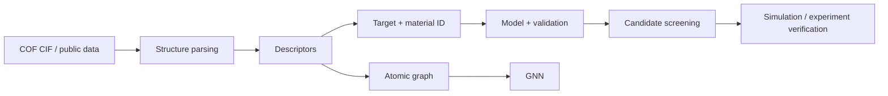

# COF-ML-Tutorial

<p align="center">
  
  
  
  
  
</p>

<p align="center"><b>Learn structure representation, property prediction, and materials screening from real COF structures and public datasets.</b></p>

<p align="center"><a href="README.md">🇨🇳 中文</a> · <a href="README.en.md">🇬🇧 English</a> · <a href="https://colab.research.google.com/github/Wanteen/COF-ML-Tutorial/blob/main/notebooks/en/00_start_here_colab.ipynb">▶ Open in Colab</a></p>

---

An open beginner course for students entering **COF / computational materials research**. The notebooks run in Google Colab and progress from CIF files and descriptors to real COF property prediction and high-throughput screening.

## Quick start

1. Read the [course guide](notebooks/en/00_course_map.ipynb).
2. Open the [English Colab entry](https://colab.research.google.com/github/Wanteen/COF-ML-Tutorial/blob/main/notebooks/en/00_start_here_colab.ipynb).
3. Recommended order: `01 → 02 → 03 → 04 → 05 → 05B → 05C → 05D`.
4. Continue to 06 GNN and 07 MLFF afterward.
5. The [bilingual notebook index](notebooks/README.md) contains all notebook and Colab links.

## COF background

**Covalent organic frameworks (COFs)** are crystalline porous networks formed by covalently connected organic building blocks. Building-block geometry, linkage chemistry, topology and layer stacking jointly influence pore structure, chemical environment and material properties.

[](assets/cof_background.jpg)

COF-1 and COF-5, reported in 2005, are early examples of translating molecular design into periodic porous frameworks. [Original paper](https://doi.org/10.1126/science.1120411)

The course follows **structure → representation → target → model → validation → screening → verification**. Hexagonal pores, a specific stacking motif, or a particular linkage are examples rather than universal COF features.

## Prerequisites

**Python:** basic variables, lists/dictionaries, function calls, `for` loops, imports and DataFrame operations.  
**COF / materials:** basic concepts of atoms, bonds, unit cells, periodic structures, pores, density and adsorption.  
**Machine learning:** no prior knowledge required.

## Course map

| Chapter | Level | Topic | Main question | Chinese | English |
|---|---|---|---|---|---|
| 00 | 🧭 | Course map | How should I learn the course? | [中文](notebooks/00_course_map.ipynb) | [English](notebooks/en/00_course_map.ipynb) |
| 01 | 🟢 | ML basics | What are features, targets and train/test splits? | [中文](notebooks/01_python_ml_basics.ipynb) | [English](notebooks/en/01_python_ml_basics.ipynb) |
| 02 | 🟢 | Structure + pymatgen | What are CIFs, unit cells, coordinates and PBC? | [中文](notebooks/02_pymatgen_structure.ipynb) | [English](notebooks/en/02_pymatgen_structure.ipynb) |
| 03 | 🟢 | Descriptors | How do we turn materials into numerical representations? | [中文](notebooks/03_material_descriptors.ipynb) | [English](notebooks/en/03_material_descriptors.ipynb) |
| 04 | 🟢 | Real COF data | How should real databases, units and provenance be checked? | [中文](notebooks/04_real_cof_dataset.ipynb) | [English](notebooks/en/04_real_cof_dataset.ipynb) |
| 05 | 🟢 | Baseline prediction | How do we train and evaluate a baseline? | [中文](notebooks/05_cof_property_prediction.ipynb) | [English](notebooks/en/05_cof_property_prediction.ipynb) |
| 05B | 🟢 | Real CIF → ML | How do real CIFs become an ML table? | [中文](notebooks/05B_real_cof_cif_to_ml.ipynb) | [English](notebooks/en/05B_real_cof_cif_to_ml.ipynb) |
| 05C | 🟢 | High-throughput screening | How can a surrogate model screen candidate COFs? | [中文](notebooks/05C_high_throughput_screening.ipynb) | [English](notebooks/en/05C_high_throughput_screening.ipynb) |
| **05D** | 🟢 | **Real COF ML datasets** | **How do we train on published adsorption datasets?** | [中文](notebooks/05D_real_cof_ml_datasets.ipynb) | [English](notebooks/en/05D_real_cof_ml_datasets.ipynb) |
| 06 | 🔵 | GNN | How can a model learn directly from atomic graphs? | [中文](notebooks/06_gnn_for_materials.ipynb) | [English](notebooks/en/06_gnn_for_materials.ipynb) |
| 07 | 🟣 | MLFF | How do ML interatomic potentials relate to DFT and MD? | [中文](notebooks/07_mlff_chgnet.ipynb) | [English](notebooks/en/07_mlff_chgnet.ipynb) |

## Real COF datasets

| Source | Contents | Teaching use |
|---|---|---|
| [CURATED-COFs](https://github.com/danieleongari/CURATED-COFs) + [Materials Cloud](https://archive.materialscloud.org/record/2021.100) | experimentally reported COFs, optimized structures, pore properties and CO₂/N₂ adsorption data | CIF ↔ ID ↔ property, small-data ML, carbon capture |
| [COFSpace](https://github.com/gokhanonderaksu/COFSpace) | simulated CO₂/CH₄/H₂/N₂/O₂ adsorption for 1060 CoRE COFs, structural/chemical/energy features, plus hypothetical-COF predictions | multi-gas regression, pressure dependence, feature importance, external prediction |
| [ReDD-COFFEE](https://github.com/jsdvos/SupportingInformation_ReDD-COFFEE_2023) | large hypothetical-COF space, pore geometry and RAC descriptors | representation, diversity and large chemical spaces |
| [CO₂ capture HTS](https://github.com/jsdvos/SupportingInformation_CO2captureHTS_2024) | ReDD-COFFEE features, GCMC results, fixed train/test splits, ML and SHAP | high-throughput screening, feature reduction and interpretability |
| [Hypothetical COFs for methane storage](https://www.materialscloud.org/discover/cofs) | 69,840 hypothetical 2D/3D COFs with GCMC methane deliverable capacities | large-scale screening and structure–property relationships |

**05D** directly reads COFSpace, CURATED-COFs adsorption tables and ReDD-COFFEE HTS results in Colab. Datasets with different simulation protocols, descriptor definitions and target conditions should not be concatenated without a compatibility analysis.

## Course workflow



## Local environment

```bash
git clone https://github.com/Wanteen/COF-ML-Tutorial.git
cd COF-ML-Tutorial
python -m venv .venv
# Windows PowerShell: .venv\Scripts\Activate.ps1
# macOS / Linux: source .venv/bin/activate
python -m pip install -r requirements.txt
python -m pip install jupyterlab
python -m jupyterlab
```

## Citation and data use

Public datasets referenced by this tutorial remain subject to the licenses and citation requirements of their original records. For research use, cite the corresponding paper, data DOI and repository, and record the structure version, target conditions, units, simulation/experimental protocol and data split.

## Author and contact

**Tutorial developer:** [Wanteen](https://github.com/Wanteen)  
**Affiliation:** 复旦大学高分子科学系 · 郭佳课题组  
Guo Group, Department of Macromolecular Science, Fudan University

- wantingshieh@gmail.com
- wantingshieh@outlook.com

## License

[MIT License](LICENSE)
