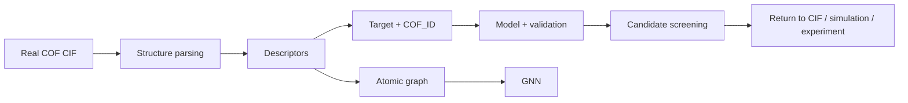

# COF-ML-Tutorial

<p align="center">
  
  
  
  
  
</p>

<p align="center"><b>Learn structure representation, property prediction, and materials screening from real COF structures.</b></p>

<p align="center"><a href="README.md">🇨🇳 中文</a> · <a href="README.en.md">🇬🇧 English</a> · <a href="https://colab.research.google.com/github/Wanteen/COF-ML-Tutorial/blob/main/notebooks/en/00_start_here_colab.ipynb">▶ Open English course in Colab</a></p>

---

This tutorial is designed for new graduate students entering **COF / computational materials research**. It starts from basic machine-learning concepts and now follows a complete materials workflow:

```text
real COF CIF
→ structure parsing
→ descriptor construction
→ target alignment
→ train / test
→ model
→ validation
→ candidate screening
→ return to structure for verification
```

The earlier version covered the individual pieces but did not fully connect real CIF files to a target/model/screening workflow. Two new capstone notebooks close that gap:

- **05B Real CIF → ML**: parse real CURATED-COFs CIF files, build descriptors, align feature/target tables with `COF_ID`, and train a baseline.
- **05C High-throughput screening**: move from a validated surrogate model to candidate ranking, applicability-domain checks, interpretation, and physical revalidation.

See the [Teaching Audit](docs/tutorial_audit_2026-09.md) for the revision rationale.

## Quick start

1. Read the [course guide](notebooks/en/00_course_map.ipynb) and COF overview.
2. Open the [English Colab start page](https://colab.research.google.com/github/Wanteen/COF-ML-Tutorial/blob/main/notebooks/en/00_start_here_colab.ipynb).
3. Complete Level A in this order: `01 → 02 → 03 → 04 → 05 → 05B → 05C`.
4. Continue to 06 GNN and 07 MLFF afterward.
5. Use the [bilingual notebook index](notebooks/README.md) to switch languages.

## COF background

**Covalent organic frameworks (COFs)** are crystalline porous networks formed by covalently connected organic building blocks. Building-block geometry, linkage chemistry, topology and layer stacking help determine pore structure, chemical environment and materials properties.

[](assets/cof_background.jpg)

*COF background overview supplied by Wanteen. Click to open the original image; author and group labels are preserved. [Figure notes](docs/visual_resources.md).*

COF-1 and COF-5 were reported in 2005 and are early examples of translating molecular design into periodic porous frameworks. [Original paper](https://doi.org/10.1126/science.1120411)

The course now follows **structure → representation → target → model → validation → screening → verification**. Hexagonal pores and a particular stacking motif are teaching examples, not universal COF features.

## Prerequisites

**Python:** basic variables, lists/dictionaries, function calls, `for` loops, imports and DataFrame operations.  
**COF / materials:** basic concepts of atoms, bonds, unit cells, periodic structures, pores, density and adsorption.  
**Machine learning:** no prior knowledge required.

## Course levels

| Level | Content | Completion criterion |
|---|---|---|
| 🟢 Level A | 01–05C | **Core**: complete a real-CIF-to-baseline-to-screening workflow |
| 🔵 Level B | 06 GNN | **Recommended**: understand atomic graphs, message passing and learned representations |
| 🟣 Supplement | 07 MLFF | **Background**: understand the relation between ML interatomic potentials, DFT and MD |

## Course map

| Chapter | Level | Topic | Main question | English notebook | Colab |
|---|---|---|---|---|---|
| 00 | 🧭 | Course map | How should I learn this course? | [View](notebooks/en/00_course_map.ipynb) | [▶](https://colab.research.google.com/github/Wanteen/COF-ML-Tutorial/blob/main/notebooks/en/00_course_map.ipynb) |
| 01 | 🟢 A | ML basics | What are feature, target, train and test? | [View](notebooks/en/01_python_ml_basics.ipynb) | [▶](https://colab.research.google.com/github/Wanteen/COF-ML-Tutorial/blob/main/notebooks/en/01_python_ml_basics.ipynb) |
| 02 | 🟢 A | Structure + pymatgen | What are CIF, lattice, coordinates and PBC? | [View](notebooks/en/02_pymatgen_structure.ipynb) | [▶](https://colab.research.google.com/github/Wanteen/COF-ML-Tutorial/blob/main/notebooks/en/02_pymatgen_structure.ipynb) |
| 03 | 🟢 A | Descriptors | How do we turn materials into numbers? | [View](notebooks/en/03_material_descriptors.ipynb) | [▶](https://colab.research.google.com/github/Wanteen/COF-ML-Tutorial/blob/main/notebooks/en/03_material_descriptors.ipynb) |
| 04 | 🟢 A | Real COF data | Why must real datasets be audited first? | [View](notebooks/en/04_real_cof_dataset.ipynb) | [▶](https://colab.research.google.com/github/Wanteen/COF-ML-Tutorial/blob/main/notebooks/en/04_real_cof_dataset.ipynb) |
| 05 | 🟢 A | Baseline prediction | How do we train and validate a baseline? | [View](notebooks/en/05_cof_property_prediction.ipynb) | [▶](https://colab.research.google.com/github/Wanteen/COF-ML-Tutorial/blob/main/notebooks/en/05_cof_property_prediction.ipynb) |
| **05B** | 🟢 A | **Real CIF → ML** | **How do real CIFs become an aligned feature/target table?** | [View](notebooks/en/05B_real_cof_cif_to_ml.ipynb) | [▶](https://colab.research.google.com/github/Wanteen/COF-ML-Tutorial/blob/main/notebooks/en/05B_real_cof_cif_to_ml.ipynb) |
| **05C** | 🟢 A | **High-throughput screening** | **How can a validated model screen unseen COFs?** | [View](notebooks/en/05C_high_throughput_screening.ipynb) | [▶](https://colab.research.google.com/github/Wanteen/COF-ML-Tutorial/blob/main/notebooks/en/05C_high_throughput_screening.ipynb) |
| 06 | 🔵 B | GNN | How can a model learn from an atomic graph? | [View](notebooks/en/06_gnn_for_materials.ipynb) | [▶](https://colab.research.google.com/github/Wanteen/COF-ML-Tutorial/blob/main/notebooks/en/06_gnn_for_materials.ipynb) |
| 07 | 🟣 Supplement | MLFF | Why do ML interatomic potentials exist? | [View](notebooks/en/07_mlff_chgnet.ipynb) | [▶](https://colab.research.google.com/github/Wanteen/COF-ML-Tutorial/blob/main/notebooks/en/07_mlff_chgnet.ipynb) |

## The course in one picture



## Suggested schedule

- Week 1: 00–01 — data, features, targets, models, training and testing.
- Week 2: 02 — unit cells, periodicity, CIF and pymatgen.
- Week 3: 03 — representations and descriptors.
- Week 4: 04 — real COF data auditing and provenance.
- Week 5: 05 — baseline modeling, splitting, leakage and validation.
- Week 6: 05B — build an ML table directly from real CIF files.
- Week 7: 05C — surrogate screening and candidate verification logic.
- Week 8 (optional): 06 — GNN concepts.
- Supplementary: 07 — MLFF background.

## Data

- [Wanteen/CURATED-COFs](https://github.com/Wanteen/CURATED-COFs): real COF CIF and metadata source used in 05B.
- `data/cof_demo.csv`: teaching-only data; `CO2_uptake_demo` is synthetic and must not be used for scientific conclusions.
- The 05C candidate target is also teaching-only and is used solely to demonstrate the HTS + surrogate workflow.

A real CO₂ adsorption/selectivity project should use targets generated or measured under consistent temperature, pressure and computational/experimental conditions, with full provenance.

## COF / porous-material ML repositories worth studying

- [SupportingInformation_CO2captureHTS_2024](https://github.com/jsdvos/SupportingInformation_CO2captureHTS_2024): COF CO₂ high-throughput screening, ML, train/test structure lists and SHAP.
- [CURATED-COFs](https://github.com/Wanteen/CURATED-COFs): experimental COF CIFs and structure-curation provenance.
- [CoRE-COF Database](https://github.com/core-cof/CoRE-COF-Database): larger versioned COF structure collections.
- [mofdscribe](https://github.com/kjappelbaum/mofdscribe): porous-material featurization, benchmarking and splitting concepts.

General tools: [pymatgen](https://pymatgen.org/), [matminer](https://hackingmaterials.lbl.gov/matminer/), [MatGL](https://matgl.ai/), [CHGNet](https://github.com/CederGroupHub/chgnet), [ALIGNN](https://github.com/atomgptlab/alignn), [Matbench](https://github.com/materialsproject/matbench).

## Local environment

```bash
git clone https://github.com/Wanteen/COF-ML-Tutorial.git
cd COF-ML-Tutorial
python -m venv .venv
# Windows PowerShell: .venv\Scripts\Activate.ps1
# macOS / Linux: source .venv/bin/activate
python -m pip install -r requirements.txt
python -m pip install jupyterlab
python -m jupyterlab
```

## COF reading

1. Côté, A. P. et al. *Porous, Crystalline, Covalent Organic Frameworks*. Science (2005). [DOI: 10.1126/science.1120411](https://doi.org/10.1126/science.1120411).
2. El-Kaderi, H. M. et al. *Designed Synthesis of 3D Covalent Organic Frameworks*. Science (2007). [DOI: 10.1126/science.1139915](https://doi.org/10.1126/science.1139915).
3. Kandambeth, S. et al. *Construction of Crystalline 2D Covalent Organic Frameworks with Remarkable Chemical (Acid/Base) Stability via a Combined Reversible and Irreversible Route*. JACS (2012). [DOI: 10.1021/ja308278w](https://doi.org/10.1021/ja308278w).

## Author and contact

**Tutorial developer:** [Wanteen](https://github.com/Wanteen)  
**Affiliation:** 复旦大学高分子科学系 · 郭佳课题组  
Guo Group, Department of Macromolecular Science, Fudan University

- [wantingshieh@gmail.com](mailto:wantingshieh@gmail.com)
- [wantingshieh@outlook.com](mailto:wantingshieh@outlook.com)

For course corrections or reproducible problems, open an [Issue](https://github.com/Wanteen/COF-ML-Tutorial/issues) with the chapter, runtime and error details.

## License

[MIT License](LICENSE)
