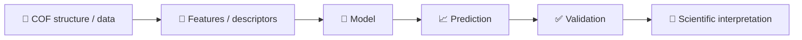

# COF-ML-Tutorial

<p align="center">
  
  
  
  
  
</p>

<p align="center"><b>A beginner-friendly machine-learning course built around COF structures and materials data.</b></p>

<p align="center">
  <a href="README.md">🇨🇳 中文</a> ·
  <a href="README.en.md">🇬🇧 English</a> ·
  <a href="https://colab.research.google.com/github/Wanteen/COF-ML-Tutorial/blob/main/notebooks/en/00_start_here_colab.ipynb">▶ Open English course in Colab</a>
</p>

---

This tutorial is designed for new graduate students entering **COF / computational materials research**. It does not assume previous machine-learning experience. The course starts from basic data concepts and gradually connects them to COF structures, descriptors, property prediction, validation, GNNs, and ML interatomic potentials.

<a id="contents"></a>

## Contents

[Quick start](#quick-start) · [COF background](#cof-background) · [Course map](#course-map) · [Data](#data) · [Contact](#contact)

<a id="quick-start"></a>

## Quick start

1. Read the COF overview below and the [course guide](notebooks/en/00_course_map.ipynb).
2. Open the [English Colab start page](https://colab.research.google.com/github/Wanteen/COF-ML-Tutorial/blob/main/notebooks/en/00_start_here_colab.ipynb) and run its setup cells.
3. Follow chapters 01–05; use the [bilingual notebook index](notebooks/README.md) to switch languages.

Each Colab notebook runs in its own runtime. If a chapter needs repository data, initialize that runtime as described in the course notebooks.

<a id="cof-background"></a>

## COF background

**Covalent organic frameworks (COFs)** are crystalline porous networks formed by covalently connected organic building blocks. Building-block geometry, linkage chemistry, topology and layer stacking help determine their pore environment and properties. The figure below introduces the concepts, selected structures, development and applications.

[](assets/cof_background.jpg)

*COF background overview supplied by Wanteen. Click to open the original image; author and group labels are preserved. [Figure notes](docs/visual_resources.md).*

COF-1 and COF-5 were reported in 2005. Their porous layered structures provide an early example of connecting molecular design to a periodic framework. [Original paper](https://doi.org/10.1126/science.1120411)

This course connects **structure → descriptors → prediction → validation**, using CO₂ uptake as a teaching example. Stability depends on the material and conditions; neither hexagonal pores nor a particular stacking arrangement is universal. Start with the [COF background in Chapter 00](notebooks/en/00_course_map.ipynb), then continue to structures (02) and descriptors (03).

## Prerequisites

**Python:** You should be able to read basic Python code, including variables, lists/dictionaries, function calls, `for` loops, `import`, and simple DataFrame operations. You do not need to be an expert programmer.

**COF / materials background:** Basic knowledge of atoms, chemical bonds, unit cells, periodic structures, pores, density, adsorption, and general physical chemistry is expected.

**Machine learning:** No prior knowledge required.

## Course levels

| Level | Content | Expectation |
|---|---|---|
| 🟢 Level A | 01–05 | **Core**: complete a reliable COF baseline workflow |
| 🔵 Level B | 06 GNN | **Recommended**: understand atomic graphs and message passing |
| 🟣 Supplement | 07 MLFF | **Background only**: no requirement to train or deploy ML potentials |

<a id="course-map"></a>

## Course map

| Chapter | Level | Topic | Main question | English notebook | Colab |
|---|---|---|---|---|---|
| 00 | 🧭 | Course map | How should I learn this course? | [View](notebooks/en/00_course_map.ipynb) | [▶](https://colab.research.google.com/github/Wanteen/COF-ML-Tutorial/blob/main/notebooks/en/00_course_map.ipynb) |
| 01 | 🟢 A | ML basics | What are feature, target, train and test? | [View](notebooks/en/01_python_ml_basics.ipynb) | [▶](https://colab.research.google.com/github/Wanteen/COF-ML-Tutorial/blob/main/notebooks/en/01_python_ml_basics.ipynb) |
| 02 | 🟢 A | Structure + pymatgen | What are CIF, lattice, coordinates and PBC? | [View](notebooks/en/02_pymatgen_structure.ipynb) | [▶](https://colab.research.google.com/github/Wanteen/COF-ML-Tutorial/blob/main/notebooks/en/02_pymatgen_structure.ipynb) |
| 03 | 🟢 A | Descriptors | How do we turn materials into numbers? | [View](notebooks/en/03_material_descriptors.ipynb) | [▶](https://colab.research.google.com/github/Wanteen/COF-ML-Tutorial/blob/main/notebooks/en/03_material_descriptors.ipynb) |
| 04 | 🟢 A | Real COF data | Why must real datasets be audited first? | [View](notebooks/en/04_real_cof_dataset.ipynb) | [▶](https://colab.research.google.com/github/Wanteen/COF-ML-Tutorial/blob/main/notebooks/en/04_real_cof_dataset.ipynb) |
| 05 | 🟢 A | COF prediction | How do we train and validate a reliable baseline? | [View](notebooks/en/05_cof_property_prediction.ipynb) | [▶](https://colab.research.google.com/github/Wanteen/COF-ML-Tutorial/blob/main/notebooks/en/05_cof_property_prediction.ipynb) |
| 06 | 🔵 B | GNN | How can a model learn from an atomic graph? | [View](notebooks/en/06_gnn_for_materials.ipynb) | [▶](https://colab.research.google.com/github/Wanteen/COF-ML-Tutorial/blob/main/notebooks/en/06_gnn_for_materials.ipynb) |
| 07 | 🟣 Supplement | MLFF | Why do ML interatomic potentials exist? | [View](notebooks/en/07_mlff_chgnet.ipynb) | [▶](https://colab.research.google.com/github/Wanteen/COF-ML-Tutorial/blob/main/notebooks/en/07_mlff_chgnet.ipynb) |

## The course in one picture



For COFs, the difficult part is often not calling an algorithm. The real questions are whether the inputs capture pore geometry, chemistry, topology and stacking; whether labels are measured under comparable conditions; and whether the train/test split truly represents known and unknown materials.

## COF visual examples

<p align="center">
  
  
</p>

<p align="center"><sub>Repository-hosted teaching illustrations: a 2D hexagonal pore network and a layered COF with pore transport. These are schematic examples for explaining pores, stacking and transport rather than specific experimental structures.</sub></p>

## Suggested schedule

- Week 1: 00–01 — data, features, targets, models, training and testing.
- Week 2: 02 — unit cells, periodicity, CIF and pymatgen.
- Week 3: 03 — representations and descriptors.
- Week 4: 04 — real COF data auditing.
- Week 5: 05 — baseline modeling and reliable validation.
- Week 6 (optional): 06 — GNN concepts.
- Supplementary: 07 — MLFF background.

<a id="data"></a>

## Data

The real-data chapter uses [Wanteen/CURATED-COFs](https://github.com/Wanteen/CURATED-COFs).

`data/cof_demo.csv` is for teaching only. `CO2_uptake_demo` is a synthetic target and must not be used for scientific conclusions.

## External resources

- [Machine Learning for Materials](https://aronwalsh.github.io/MLforMaterials/)
- [pymatgen](https://pymatgen.org/)
- [matminer](https://hackingmaterials.lbl.gov/matminer/)
- [JARVIS notebooks](https://github.com/atomgptlab/jarvis-tools-notebooks)
- [MatGL](https://matgl.ai/)
- [CHGNet](https://github.com/CederGroupHub/chgnet)
- [ALIGNN](https://github.com/atomgptlab/alignn)
- [Matbench](https://github.com/materialsproject/matbench)

## Local environment

From a local checkout:

```bash
git clone https://github.com/Wanteen/COF-ML-Tutorial.git
cd COF-ML-Tutorial
python -m venv .venv
# Windows PowerShell: .venv\Scripts\Activate.ps1
# macOS / Linux: source .venv/bin/activate
python -m pip install -r requirements.txt
python -m pip install jupyterlab
python -m jupyterlab
```

Open `notebooks/en/00_course_map.ipynb`. Some chapters also contain dependency installation cells.

## COF reading

1. Côté, A. P. et al. *Porous, Crystalline, Covalent Organic Frameworks*. Science (2005). [DOI: 10.1126/science.1120411](https://doi.org/10.1126/science.1120411).
2. El-Kaderi, H. M. et al. *Designed Synthesis of 3D Covalent Organic Frameworks*. Science (2007). [DOI: 10.1126/science.1139915](https://doi.org/10.1126/science.1139915).
3. Kandambeth, S. et al. *Construction of Crystalline 2D Covalent Organic Frameworks with Remarkable Chemical (Acid/Base) Stability via a Combined Reversible and Irreversible Route*. JACS (2012). [DOI: 10.1021/ja308278w](https://doi.org/10.1021/ja308278w).

<a id="contact"></a>

## Author and contact

**Tutorial developer:** [Wanteen](https://github.com/Wanteen)<br>
**Affiliation:** 复旦大学高分子科学系 · 郭佳课题组<br>
Guo Group, Department of Macromolecular Science, Fudan University

- [wantingshieh@gmail.com](mailto:wantingshieh@gmail.com)
- [wantingshieh@outlook.com](mailto:wantingshieh@outlook.com)

For course corrections or reproducible problems, open an [Issue](https://github.com/Wanteen/COF-ML-Tutorial/issues) with the chapter, runtime and error details.

## License

[MIT License](LICENSE)
