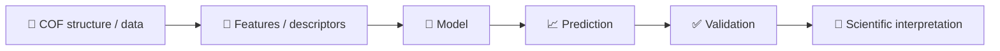

# 🧪 COF-ML-Tutorial

<p align="center">
  
  
  
  
  
</p>

<p align="center"><b>从 COF 结构与材料数据出发，循序渐进理解机器学习。</b><br>
<b>Learn machine learning step by step from COF structures and materials data.</b></p>

<p align="center">
  <a href="README.md">🇨🇳 中文</a> ·
  <a href="README.en.md">🇬🇧 English</a> ·
  <a href="https://colab.research.google.com/github/Wanteen/COF-ML-Tutorial/blob/main/notebooks/00_start_here_colab.ipynb">▶ Open in Colab</a>
</p>

---

> 面向 **COF / 计算材料方向新入学研究生** 的机器学习入门教程。  
> **GitHub 阅读 + Google Colab 运行 + COF 数据实践。**

本教程不是机器学习专业课程，也不要求学生一开始就理解复杂模型。核心目标是：先建立最基本的数据与模型概念，再逐步连接到 COF 结构、描述符、性质预测和科研中的验证问题。

## 🎯 课程定位

适合：刚进入 COF / 计算材料课题组、没有系统学习过机器学习、能看懂基础 Python 代码、并具备基本 COF / 物理化学知识的研究生。

**Python 前置要求：** 能看懂变量、list/dict、函数调用、`for` 循环、`import`、DataFrame 等基本代码结构即可，不要求熟练编程。

**COF / 材料前置要求：** 理解原子、化学键、晶胞、周期性结构、孔道、密度、吸附等基本物理化学概念。

**机器学习前置要求：** 无。

## 🧭 学习层级

| 层级 | 内容 | 要求 |
|---|---|---|
| 🟢 Level A | 01–05 | **必须掌握**：完成完整 COF baseline workflow |
| 🔵 Level B | 06 GNN | **建议了解**：理解 atomic graph 和 message passing |
| 🟣 Supplement | 07 MLFF | **补充阅读**：建立背景，不要求掌握训练或生产模拟 |

## 📚 Course map

| Chapter | Level | Topic | 主要问题 | 中文 | English | Colab |
|---|---|---|---|---|---|---|
| 00 | 🧭 | Course map | 课程怎么学？ | [中文](notebooks/00_course_map.ipynb) | [English](notebooks/en/00_course_map.ipynb) | [▶](https://colab.research.google.com/github/Wanteen/COF-ML-Tutorial/blob/main/notebooks/00_course_map.ipynb) |
| 01 | 🟢 A | ML basics | feature、target、train/test 是什么？ | [中文](notebooks/01_python_ml_basics.ipynb) | [English](notebooks/en/01_python_ml_basics.ipynb) | [▶](https://colab.research.google.com/github/Wanteen/COF-ML-Tutorial/blob/main/notebooks/01_python_ml_basics.ipynb) |
| 02 | 🟢 A | Structure + pymatgen | CIF、晶胞、坐标、PBC 是什么？ | [中文](notebooks/02_pymatgen_structure.ipynb) | [English](notebooks/en/02_pymatgen_structure.ipynb) | [▶](https://colab.research.google.com/github/Wanteen/COF-ML-Tutorial/blob/main/notebooks/02_pymatgen_structure.ipynb) |
| 03 | 🟢 A | Descriptors | 如何把材料变成模型能读取的数字？ | [中文](notebooks/03_material_descriptors.ipynb) | [English](notebooks/en/03_material_descriptors.ipynb) | [▶](https://colab.research.google.com/github/Wanteen/COF-ML-Tutorial/blob/main/notebooks/03_material_descriptors.ipynb) |
| 04 | 🟢 A | Real COF data | 真实数据库为什么不能直接训练？ | [中文](notebooks/04_real_cof_dataset.ipynb) | [English](notebooks/en/04_real_cof_dataset.ipynb) | [▶](https://colab.research.google.com/github/Wanteen/COF-ML-Tutorial/blob/main/notebooks/04_real_cof_dataset.ipynb) |
| 05 | 🟢 A | COF prediction | 如何训练、评价并避免虚假高精度？ | [中文](notebooks/05_cof_property_prediction.ipynb) | [English](notebooks/en/05_cof_property_prediction.ipynb) | [▶](https://colab.research.google.com/github/Wanteen/COF-ML-Tutorial/blob/main/notebooks/05_cof_property_prediction.ipynb) |
| 06 | 🔵 B | GNN | 为什么可以直接从原子图学习？ | [中文](notebooks/06_gnn_for_materials.ipynb) | [English](notebooks/en/06_gnn_for_materials.ipynb) | [▶](https://colab.research.google.com/github/Wanteen/COF-ML-Tutorial/blob/main/notebooks/06_gnn_for_materials.ipynb) |
| 07 | 🟣 Supplement | MLFF | MLFF 与 DFT / MD 有什么关系？ | [中文](notebooks/07_mlff_chgnet.ipynb) | [English](notebooks/en/07_mlff_chgnet.ipynb) | [▶](https://colab.research.google.com/github/Wanteen/COF-ML-Tutorial/blob/main/notebooks/07_mlff_chgnet.ipynb) |

## 🧠 一张图理解整门课



对于 COF，真正困难的通常不是调用算法，而是输入是否包含孔径、孔隙率、化学组成、官能团、拓扑、层间堆积等重要信息；target 是否来自一致条件；以及 train/test 是否真正代表“已知”和“未知”材料。

## 🖼️ COF 结构视觉素材

<p align="center">
  
  
</p>

<p align="center"><sub>示意结构：DAAQ-TFP 与 TpOMe-DAQ COFs。Images by Tyran Gunther (UU), Wikimedia Commons, CC BY-SA 4.0. 详见 <a href="docs/visual_resources.md">Visual resources & attribution</a>.</sub></p>

## 🗓️ 推荐学习顺序

- Week 1：00–01，理解数据、feature、target、model、training/test。
- Week 2：02，理解晶胞、周期性、CIF 与 pymatgen。
- Week 3：03，理解 representation 与 descriptors。
- Week 4：04，练习真实 COF 数据审计。
- Week 5：05，完成 baseline 与可靠验证。
- Week 6（可选）：06，了解 GNN。
- Supplementary：07，了解 MLFF 背景。

## 🧪 数据

真实 COF 数据部分使用 [Wanteen/CURATED-COFs](https://github.com/Wanteen/CURATED-COFs)。

`data/cof_demo.csv` 仅用于教学，其中 `CO2_uptake_demo` 为人工构造 target，不能用于科研结论。

## ✅ 完成 00–05 后的最低目标

学生应能解释：feature 与 target 的区别；为什么需要 train/test split；MAE/RMSE/R² 的基本意义；CIF 如何表示晶胞与原子；为什么 COF 的 `a` 和 `b` 不一定相等；descriptor 为什么是“材料 → 数字”的桥梁；为什么真实数据要检查缺失、重复、单位和实验条件；以及为什么 random split 可能高估同系列 COF 的泛化能力。

## 📖 外部资源

- [Machine Learning for Materials](https://aronwalsh.github.io/MLforMaterials/)
- [pymatgen](https://pymatgen.org/)
- [matminer](https://hackingmaterials.lbl.gov/matminer/)
- [JARVIS notebooks](https://github.com/atomgptlab/jarvis-tools-notebooks)
- [MatGL](https://matgl.ai/)
- [CHGNet](https://github.com/CederGroupHub/chgnet)
- [ALIGNN](https://github.com/atomgptlab/alignn)
- [Matbench](https://github.com/materialsproject/matbench)

## 🚀 Environment

推荐直接使用 Google Colab：

[▶ Open course start page in Colab](https://colab.research.google.com/github/Wanteen/COF-ML-Tutorial/blob/main/notebooks/00_start_here_colab.ipynb)

本地运行：

```bash
pip install -r requirements.txt
```

## 📄 License

MIT
