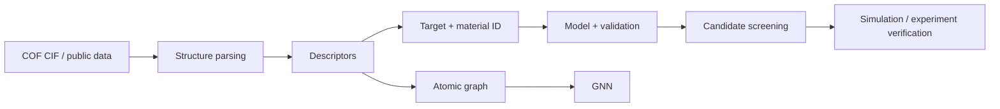

# COF-ML-Tutorial

<p align="center">
  
  
  
  
  
</p>

<p align="center"><b>从真实 COF 结构与公开数据出发，学习结构表示、性质预测与材料筛选。</b><br><b>Learn structure representation, property prediction, and materials screening from real COF structures and public datasets.</b></p>

<p align="center"><a href="README.md">🇨🇳 中文</a> · <a href="README.en.md">🇬🇧 English</a> · <a href="https://colab.research.google.com/github/Wanteen/COF-ML-Tutorial/blob/main/notebooks/00_start_here_colab.ipynb">▶ Open in Colab</a></p>

---

面向 **COF / 计算材料方向本科高年级学生、研究生与机器学习初学者** 的公开教程。课程采用 GitHub 阅读、Google Colab 运行，并逐步从 CIF、描述符和数据表进入真实 COF 性质预测与高通量筛选。

## 快速开始

1. 阅读 [00 课程说明](notebooks/00_course_map.ipynb)。
2. 打开 [中文 Colab 入口](https://colab.research.google.com/github/Wanteen/COF-ML-Tutorial/blob/main/notebooks/00_start_here_colab.ipynb)。
3. 推荐顺序：`01 → 02 → 03 → 04 → 05 → 05B → 05C → 05D`。
4. 之后可继续学习 06 GNN 和 07 MLFF。
5. [双语课程索引](notebooks/README.md) 提供全部 notebook 与 Colab 入口。

## COF 背景

**共价有机框架（Covalent Organic Frameworks, COFs）** 是有机构筑单元通过共价键连接形成的晶态多孔网络。构筑单元几何、连接化学、拓扑与层间堆积共同影响孔结构、化学环境和材料性质。

[](assets/cof_background.jpg)

2005 年报道的 COF-1、COF-5 是早期代表，其多孔层状结构展示了从分子设计构筑周期框架的思路。[原始论文](https://doi.org/10.1126/science.1120411)

课程围绕 **structure → representation → target → model → validation → screening → verification** 展开。六方孔、特定堆积方式或某一类连接键仅作为示例，并非所有 COF 的共同特征。

## 前置要求

**Python：** 能阅读变量、list/dict、函数调用、`for` 循环、`import` 和 DataFrame 等基础代码即可。  
**COF / 材料：** 建议理解原子、化学键、晶胞、周期性结构、孔道、密度和吸附等基本概念。  
**机器学习：** 无前置要求。

## 课程目录

| Chapter | Level | Topic | 主要问题 | 中文 | English |
|---|---|---|---|---|---|
| 00 | 🧭 | Course map | 课程怎么学？ | [中文](notebooks/00_course_map.ipynb) | [English](notebooks/en/00_course_map.ipynb) |
| 01 | 🟢 | ML basics | feature、target、train/test 是什么？ | [中文](notebooks/01_python_ml_basics.ipynb) | [English](notebooks/en/01_python_ml_basics.ipynb) |
| 02 | 🟢 | Structure + pymatgen | CIF、晶胞、坐标和 PBC 是什么？ | [中文](notebooks/02_pymatgen_structure.ipynb) | [English](notebooks/en/02_pymatgen_structure.ipynb) |
| 03 | 🟢 | Descriptors | 如何把材料变成模型能读取的数字？ | [中文](notebooks/03_material_descriptors.ipynb) | [English](notebooks/en/03_material_descriptors.ipynb) |
| 04 | 🟢 | Real COF data | 如何检查真实数据库、单位和 provenance？ | [中文](notebooks/04_real_cof_dataset.ipynb) | [English](notebooks/en/04_real_cof_dataset.ipynb) |
| 05 | 🟢 | Baseline prediction | 如何训练并评价 baseline？ | [中文](notebooks/05_cof_property_prediction.ipynb) | [English](notebooks/en/05_cof_property_prediction.ipynb) |
| 05B | 🟢 | Real CIF → ML | 如何从真实 CIF 自动构建 ML 表格？ | [中文](notebooks/05B_real_cof_cif_to_ml.ipynb) | [English](notebooks/en/05B_real_cof_cif_to_ml.ipynb) |
| 05C | 🟢 | High-throughput screening | 如何用 surrogate model 筛选候选 COF？ | [中文](notebooks/05C_high_throughput_screening.ipynb) | [English](notebooks/en/05C_high_throughput_screening.ipynb) |
| **05D** | 🟢 | **Real COF ML datasets** | **如何使用公开发表的真实 adsorption 数据训练模型？** | [中文](notebooks/05D_real_cof_ml_datasets.ipynb) | [English](notebooks/en/05D_real_cof_ml_datasets.ipynb) |
| 06 | 🔵 | GNN | 为什么可以直接从原子图学习？ | [中文](notebooks/06_gnn_for_materials.ipynb) | [English](notebooks/en/06_gnn_for_materials.ipynb) |
| 07 | 🟣 | MLFF | MLFF 与 DFT / MD 有什么关系？ | [中文](notebooks/07_mlff_chgnet.ipynb) | [English](notebooks/en/07_mlff_chgnet.ipynb) |

## 真实 COF 数据集

| 数据源 | 内容 | 教学用途 |
|---|---|---|
| [CURATED-COFs](https://github.com/danieleongari/CURATED-COFs) + [Materials Cloud](https://archive.materialscloud.org/record/2021.100) | 实验报道 COF、优化结构、孔性质、CO₂/N₂ adsorption 数据 | CIF ↔ ID ↔ property、small-data ML、carbon capture |
| [COFSpace](https://github.com/gokhanonderaksu/COFSpace) | 1060 CoRE COFs 的 CO₂/CH₄/H₂/N₂/O₂ 模拟 adsorption、结构/化学/能量 features；另含 hypothetical COF predictions | 多气体/多压力 regression、feature importance、external prediction |
| [ReDD-COFFEE](https://github.com/jsdvos/SupportingInformation_ReDD-COFFEE_2023) | 大规模 hypothetical COF、pore geometry 与 RAC descriptors | representation、diversity、large chemical space |
| [CO₂ capture HTS](https://github.com/jsdvos/SupportingInformation_CO2captureHTS_2024) | ReDD-COFFEE 的 features、GCMC results、固定 train/test split、ML 与 SHAP | high-throughput screening、feature reduction、interpretability |
| [Hypothetical COFs for methane storage](https://www.materialscloud.org/discover/cofs) | 69,840 个 hypothetical 2D/3D COF 与 GCMC methane deliverable capacity | 大规模 screening、structure–property relationship |

**05D** 已直接接入 COFSpace、CURATED-COFs adsorption 表和 ReDD-COFFEE HTS results，让学生可以在 Colab 中读取真实公开 target 并训练 baseline。不同数据库的计算协议和 target 条件不同，不应未经检查直接拼接。

## 一张图理解整门课



## 本地运行

```bash
git clone https://github.com/Wanteen/COF-ML-Tutorial.git
cd COF-ML-Tutorial
python -m venv .venv
# Windows PowerShell: .venv\Scripts\Activate.ps1
# macOS / Linux: source .venv/bin/activate
python -m pip install -r requirements.txt
python -m pip install jupyterlab
python -m jupyterlab
```

## 引用与数据使用

本教程引用的公开数据仍归各原始数据集和论文定义的许可与引用要求管理。用于科研或发表时，请引用对应原始论文、数据 DOI 和代码仓库，并记录结构版本、target 条件、单位、模拟/实验协议和数据划分。

## 作者与联系

**Tutorial developer:** [Wanteen](https://github.com/Wanteen)  
**Affiliation:** 复旦大学高分子科学系 · 郭佳课题组  
Guo Group, Department of Macromolecular Science, Fudan University

- wantingshieh@gmail.com
- wantingshieh@outlook.com

## License

[MIT License](LICENSE)
