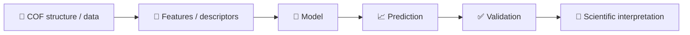

# 🧪 COF-ML-Tutorial

  
  
  
  
  

<b>从 COF 结构与材料数据出发，循序渐进理解机器学习。</b> <b>Learn machine learning step by step from COF structures and materials data.</b>

<b>复旦大学高分子科学系 · 郭佳课题组</b> Guo Group, Department of Polymer Science, Fudan University 教程开发：Wanteen · Tutorial developed by Wanteen

<a href="README.md">🇨🇳 中文</a> · <a href="README.en.md">🇬🇧 English</a> · 

---

> 面向 **COF / 计算材料方向新入学研究生** 的机器学习入门教程。  
> **GitHub 阅读 + Google Colab 运行 + COF 数据实践。**

## 🧱 COF 是什么？

**共价有机框架（Covalent Organic Frameworks, COFs）** 是由有机分子构筑单元通过共价键连接形成的周期性多孔晶态材料。可以把它们初步理解为：研究者选择具有特定连接方式的 **node / building unit（节点/构筑单元）** 与 **linker（连接单元）**，通过有机反应构筑具有规则孔道的二维或三维网络。

COF 的组成、连接键、拓扑、孔径、官能团以及二维材料的层间堆积方式都可以改变材料性质，因此 COF 很适合作为材料信息学和机器学习的教学对象。本教程会逐渐把“化学结构”转化成“机器学习可以处理的数据”，但不会替代系统的 COF 化学、晶体学或高分子科学课程。

## 🎯 课程定位与前置要求

本教程适合刚进入 COF / 计算材料研究、没有系统学习过机器学习的本科高年级学生或研究生。

**Python：** 能看懂变量、list/dict、函数调用、`for` 循环、`import`、DataFrame 等基本代码结构即可，不要求熟练编程。

**COF / 材料：** 建议具备基础化学和物理化学知识，并理解原子、化学键、晶胞、周期性结构、孔道、密度、吸附等基本概念。不了解 COF 的学生应先阅读上面的“COF 是什么？”以及 00/02 章节。

**机器学习：** 无前置要求。

## 🧭 学习层级

| 层级 | 内容 | 要求 |
|---|---|---|
| 🟢 Level A | 01–05 | **必须掌握**：完成完整 COF baseline workflow |
| 🔵 Level B | 06 GNN | **建议了解**：理解 atomic graph 和 message passing |
| 🟣 Supplement | 07 MLFF | **补充阅读**：建立背景，不要求掌握训练或生产模拟 |

## 📚 Course map

| Chapter | Level | Topic | 主要问题 | 中文 | English | Colab |
|---|---|---|---|---|---|---|
| 00 | 🧭 | Course map | 课程怎么学？ | [中文](notebooks/00_course_map.ipynb) | [English](notebooks/en/00_course_map.ipynb) | [▶](https://colab.research.google.com/github/Wanteen/COF-ML-Tutorial/blob/main/notebooks/00_course_map.ipynb) |
| 01 | 🟢 A | ML basics | feature、target、train/test 是什么？ | [中文](notebooks/01_python_ml_basics.ipynb) | [English](notebooks/en/01_python_ml_basics.ipynb) | [▶](https://colab.research.google.com/github/Wanteen/COF-ML-Tutorial/blob/main/notebooks/01_python_ml_basics.ipynb) |
| 02 | 🟢 A | Structure + pymatgen | CIF、晶胞、坐标、PBC 是什么？ | [中文](notebooks/02_pymatgen_structure.ipynb) | [English](notebooks/en/02_pymatgen_structure.ipynb) | [▶](https://colab.research.google.com/github/Wanteen/COF-ML-Tutorial/blob/main/notebooks/02_pymatgen_structure.ipynb) |
| 03 | 🟢 A | Descriptors | 如何把材料变成模型能读取的数字？ | [中文](notebooks/03_material_descriptors.ipynb) | [English](notebooks/en/03_material_descriptors.ipynb) | [▶](https://colab.research.google.com/github/Wanteen/COF-ML-Tutorial/blob/main/notebooks/03_material_descriptors.ipynb) |
| 04 | 🟢 A | Real COF data | 真实数据库为什么不能直接训练？ | [中文](notebooks/04_real_cof_dataset.ipynb) | [English](notebooks/en/04_real_cof_dataset.ipynb) | [▶](https://colab.research.google.com/github/Wanteen/COF-ML-Tutorial/blob/main/notebooks/04_real_cof_dataset.ipynb) |
| 05 | 🟢 A | COF prediction | 如何训练、评价并避免虚假高精度？ | [中文](notebooks/05_cof_property_prediction.ipynb) | [English](notebooks/en/05_cof_property_prediction.ipynb) | [▶](https://colab.research.google.com/github/Wanteen/COF-ML-Tutorial/blob/main/notebooks/05_cof_property_prediction.ipynb) |
| 06 | 🔵 B | GNN | 为什么可以直接从原子图学习？ | [中文](notebooks/06_gnn_for_materials.ipynb) | [English](notebooks/en/06_gnn_for_materials.ipynb) | [▶](https://colab.research.google.com/github/Wanteen/COF-ML-Tutorial/blob/main/notebooks/06_gnn_for_materials.ipynb) |
| 07 | 🟣 Supplement | MLFF | MLFF 与 DFT / MD 有什么关系？ | [中文](notebooks/07_mlff_chgnet.ipynb) | [English](notebooks/en/07_mlff_chgnet.ipynb) | [▶](https://colab.research.google.com/github/Wanteen/COF-ML-Tutorial/blob/main/notebooks/07_mlff_chgnet.ipynb) |

## 🧠 一张图理解整门课

## 🖼️ COF 结构示意

左：修正后的单个二维六方孔拓扑示意，只用于解释 node–linker–pore 关系；右：层状 COF 的 stacking / transport 教学示意。示意图不对应具体实验结构。

> **实验结构素材：** 本教程还将使用作者本人绘制的 TpBD / TpAZ / TpDAAQ / TpBpy / TpPhen 等 COF 构筑单元与孔道结构图。原始科研图片属于课题组素材，发布到公开仓库前保留作者标注并采用仓库内文件，避免外部热链。

## 🗓️ 推荐学习顺序

- Week 1：00–01，理解数据、feature、target、model、training/test。
- Week 2：02，理解晶胞、周期性、CIF 与 pymatgen。
- Week 3：03，理解 representation 与 descriptors。
- Week 4：04，练习真实 COF 数据审计。
- Week 5：05，完成 baseline 与可靠验证。
- Week 6（可选）：06，了解 GNN。
- Supplementary：07，了解 MLFF 背景。

## 🧪 数据

真实 COF 数据部分使用 [Wanteen/CURATED-COFs](https://github.com/Wanteen/CURATED-COFs)。`data/cof_demo.csv` 仅用于教学，其中 `CO2_uptake_demo` 为人工构造 target，不能用于科研结论。

## 📖 外部资源

- [Machine Learning for Materials](https://aronwalsh.github.io/MLforMaterials/)
- [pymatgen](https://pymatgen.org/)
- [matminer](https://hackingmaterials.lbl.gov/matminer/)
- [JARVIS notebooks](https://github.com/atomgptlab/jarvis-tools-notebooks)
- [MatGL](https://matgl.ai/)
- [CHGNet](https://github.com/CederGroupHub/chgnet)
- [ALIGNN](https://github.com/atomgptlab/alignn)
- [Matbench](https://github.com/materialsproject/matbench)

## 🚀 Environment

推荐直接使用 Google Colab：[▶ Open course start page in Colab](https://colab.research.google.com/github/Wanteen/COF-ML-Tutorial/blob/main/notebooks/00_start_here_colab.ipynb)

本地运行：`pip install -r requirements.txt`

## 👥 Project attribution

**所属 / Affiliation:** 复旦大学高分子科学系郭佳课题组（Guo Group, Department of Polymer Science, Fudan University）  
**教程开发 / Tutorial developer:** Wanteen

## 📄 License

MIT
