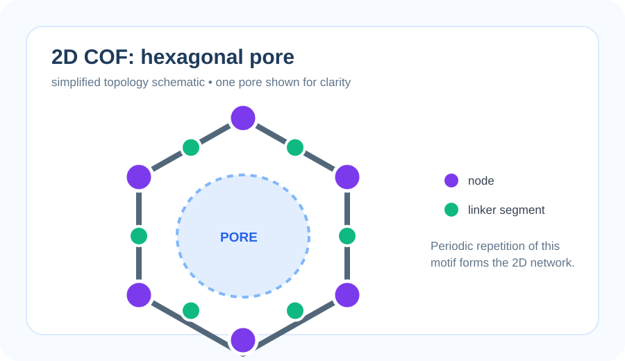
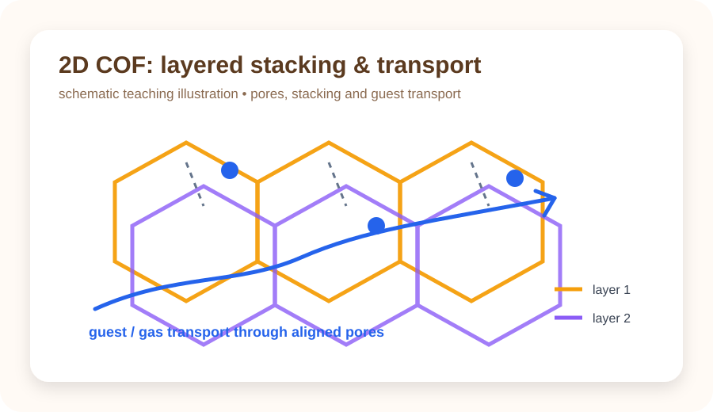

# COF-ML-Tutorial

<p align="center">
  
  
  
  
  
</p>

<p align="center"><b>从 COF 结构与材料数据出发，循序渐进理解机器学习。</b><br><b>Learn machine learning step by step from COF structures and materials data.</b></p>

<p align="center"><b>复旦大学高分子科学系 · 郭佳课题组</b><br>Guo Group, Department of Macromolecular Science, Fudan University<br><sub>教程开发：Wanteen · Tutorial developed by Wanteen</sub></p>

<p align="center"><a href="README.md">🇨🇳 中文</a> · <a href="README.en.md">🇬🇧 English</a> · <a href="https://colab.research.google.com/github/Wanteen/COF-ML-Tutorial/blob/main/notebooks/00_start_here_colab.ipynb">▶ Open in Colab</a></p>

---

> 面向 **COF / 计算材料方向新入学研究生** 的机器学习入门教程。<br>
> **GitHub 阅读 + Google Colab 运行 + COF 数据实践。**

<a id="contents"></a>

## 目录

[快速开始](#quick-start) · [COF 背景](#cof-background) · [课程目录](#course-map) · [数据说明](#data) · [作者与联系](#contact)

<a id="quick-start"></a>

## 快速开始

1. 阅读下方 COF 背景图与 [00 课程说明](notebooks/00_course_map.ipynb)。
2. 打开 [中文 Colab 入口](https://colab.research.google.com/github/Wanteen/COF-ML-Tutorial/blob/main/notebooks/00_start_here_colab.ipynb)，运行初始化单元。
3. 按 01–05 顺序学习；通过 [双语课程索引](notebooks/README.md) 切换语言。

不同 Colab Notebook 使用各自的运行环境；需要仓库数据时，请按对应章节说明在当前环境中初始化。

<a id="cof-background"></a>

## COF 背景介绍

**共价有机框架（Covalent Organic Frameworks, COFs）** 是有机构筑单元通过共价键连接形成的晶态多孔网络。构筑单元的几何形状、连接化学、拓扑以及层间堆积共同影响孔道环境与材料性质。下图概览了 COF 的基本概念、结构示例、发展与应用。

[](assets/cof_background.jpg)

*背景图由 Wanteen 提供，保留图中作者与课题组标注；点击查看高清原图。[图片说明](docs/visual_resources.md)。*

2005 年报道的 COF-1、COF-5 是早期代表，其多孔层状结构展示了从分子设计构筑周期框架的思路。[原始论文](https://doi.org/10.1126/science.1120411)

本课程围绕 **结构 → 描述符 → 性质预测 → 验证** 展开，以 CO₂ 吸附量预测连接材料问题与机器学习。具体材料的稳定性取决于连接键和使用条件；六方孔或某一种堆积方式也不是所有 COF 的共同特征。建议先阅读 [00 章 COF 背景介绍](notebooks/00_course_map.ipynb)，再进入 02 章结构与 03 章描述符。

## 课程定位与前置要求

本教程适合刚进入 COF / 计算材料研究、没有系统学习过机器学习的本科高年级学生或研究生。

**Python：** 能看懂变量、list/dict、函数调用、`for` 循环、`import`、DataFrame 等基本代码结构即可，不要求熟练编程。

**COF / 材料：** 建议具备基础化学和物理化学知识，并理解原子、化学键、晶胞、周期性结构、孔道、密度、吸附等基本概念。不了解 COF 的学生应先阅读上面的“COF 背景介绍”以及 00/02 章节。

**机器学习：** 无前置要求。

## 学习层级

| 层级 | 内容 | 要求 |
|---|---|---|
| 🟢 Level A | 01–05 | **必须掌握**：完成完整 COF baseline workflow |
| 🔵 Level B | 06 GNN | **建议了解**：理解 atomic graph 和 message passing |
| 🟣 Supplement | 07 MLFF | **补充阅读**：建立背景，不要求掌握训练或生产模拟 |

<a id="course-map"></a>

## 课程目录

| Chapter | Level | Topic | 主要问题 | 中文 | English | Colab |
|---|---|---|---|---|---|---|
| 00 | 🧭 | Course map | 课程怎么学？ | [中文](notebooks/00_course_map.ipynb) | [English](notebooks/en/00_course_map.ipynb) | [▶](https://colab.research.google.com/github/Wanteen/COF-ML-Tutorial/blob/main/notebooks/00_course_map.ipynb) |
| 01 | 🟢 A | ML basics | feature、target、train/test 是什么？ | [中文](notebooks/01_python_ml_basics.ipynb) | [English](notebooks/en/01_python_ml_basics.ipynb) | [▶](https://colab.research.google.com/github/Wanteen/COF-ML-Tutorial/blob/main/notebooks/01_python_ml_basics.ipynb) |
| 02 | 🟢 A | Structure + pymatgen | CIF、晶胞、坐标、PBC 是什么？ | [中文](notebooks/02_pymatgen_structure.ipynb) | [English](notebooks/en/02_pymatgen_structure.ipynb) | [▶](https://colab.research.google.com/github/Wanteen/COF-ML-Tutorial/blob/main/notebooks/02_pymatgen_structure.ipynb) |
| 03 | 🟢 A | Descriptors | 如何把材料变成模型能读取的数字？ | [中文](notebooks/03_material_descriptors.ipynb) | [English](notebooks/en/03_material_descriptors.ipynb) | [▶](https://colab.research.google.com/github/Wanteen/COF-ML-Tutorial/blob/main/notebooks/03_material_descriptors.ipynb) |
| 04 | 🟢 A | Real COF data | 真实数据库为什么不能直接训练？ | [中文](notebooks/04_real_cof_dataset.ipynb) | [English](notebooks/en/04_real_cof_dataset.ipynb) | [▶](https://colab.research.google.com/github/Wanteen/COF-ML-Tutorial/blob/main/notebooks/04_real_cof_dataset.ipynb) |
| 05 | 🟢 A | COF prediction | 如何训练、评价并避免虚假高精度？ | [中文](notebooks/05_cof_property_prediction.ipynb) | [English](notebooks/en/05_cof_property_prediction.ipynb) | [▶](https://colab.research.google.com/github/Wanteen/COF-ML-Tutorial/blob/main/notebooks/05_cof_property_prediction.ipynb) |
| 06 | 🔵 B | GNN | 为什么可以直接从原子图学习？ | [中文](notebooks/06_gnn_for_materials.ipynb) | [English](notebooks/en/06_gnn_for_materials.ipynb) | [▶](https://colab.research.google.com/github/Wanteen/COF-ML-Tutorial/blob/main/notebooks/06_gnn_for_materials.ipynb) |
| 07 | 🟣 Supplement | MLFF | MLFF 与 DFT / MD 有什么关系？ | [中文](notebooks/07_mlff_chgnet.ipynb) | [English](notebooks/en/07_mlff_chgnet.ipynb) | [▶](https://colab.research.google.com/github/Wanteen/COF-ML-Tutorial/blob/main/notebooks/07_mlff_chgnet.ipynb) |

## 一张图理解整门课


## COF 结构示意

<p align="center"></p>

<p align="center"><sub>左：修正后的单个二维六方孔拓扑示意，只用于解释 node–linker–pore 关系；右：层状 COF 的 stacking / transport 教学示意。示意图不对应具体实验结构。</sub></p>

## 推荐学习顺序

- Week 1：00–01，理解数据、feature、target、model、training/test。
- Week 2：02，理解晶胞、周期性、CIF 与 pymatgen。
- Week 3：03，理解 representation 与 descriptors。
- Week 4：04，练习真实 COF 数据审计。
- Week 5：05，完成 baseline 与可靠验证。
- Week 6（可选）：06，了解 GNN。
- Supplementary：07，了解 MLFF 背景。

<a id="data"></a>

## 数据

真实 COF 数据部分使用 [Wanteen/CURATED-COFs](https://github.com/Wanteen/CURATED-COFs)。`data/cof_demo.csv` 仅用于教学，其中 `CO2_uptake_demo` 为人工构造 target，不能用于科研结论。

## 外部资源

- [Machine Learning for Materials](https://aronwalsh.github.io/MLforMaterials/)
- [pymatgen](https://pymatgen.org/)
- [matminer](https://hackingmaterials.lbl.gov/matminer/)
- [JARVIS notebooks](https://github.com/atomgptlab/jarvis-tools-notebooks)
- [MatGL](https://matgl.ai/)
- [CHGNet](https://github.com/CederGroupHub/chgnet)
- [ALIGNN](https://github.com/atomgptlab/alignn)
- [Matbench](https://github.com/materialsproject/matbench)

## 本地运行环境

```bash
git clone https://github.com/Wanteen/COF-ML-Tutorial.git
cd COF-ML-Tutorial
python -m venv .venv
# Windows PowerShell: .venv\Scripts\Activate.ps1
# macOS / Linux: source .venv/bin/activate
python -m pip install -r requirements.txt
python -m pip install jupyterlab
python -m jupyterlab
```

打开 `notebooks/00_course_map.ipynb` 开始阅读。部分章节另有依赖安装单元。

## COF 延伸阅读

1. Côté, A. P. et al. *Porous, Crystalline, Covalent Organic Frameworks*. Science (2005). [DOI: 10.1126/science.1120411](https://doi.org/10.1126/science.1120411).
2. El-Kaderi, H. M. et al. *Designed Synthesis of 3D Covalent Organic Frameworks*. Science (2007). [DOI: 10.1126/science.1139915](https://doi.org/10.1126/science.1139915).
3. Kandambeth, S. et al. *Construction of Crystalline 2D Covalent Organic Frameworks with Remarkable Chemical (Acid/Base) Stability via a Combined Reversible and Irreversible Route*. JACS (2012). [DOI: 10.1021/ja308278w](https://doi.org/10.1021/ja308278w).

<a id="contact"></a>

## 作者与联系

**教程开发:** [Wanteen](https://github.com/Wanteen)<br>
**所属:** 复旦大学高分子科学系 · 郭佳课题组<br>
Guo Group, Department of Macromolecular Science, Fudan University

- [wantingshieh@gmail.com](mailto:wantingshieh@gmail.com)
- [wantingshieh@outlook.com](mailto:wantingshieh@outlook.com)

课程勘误与可复现的问题可通过 [Issues](https://github.com/Wanteen/COF-ML-Tutorial/issues) 反馈，请附章节、运行环境与报错信息。

## 许可证

[MIT License](LICENSE)
