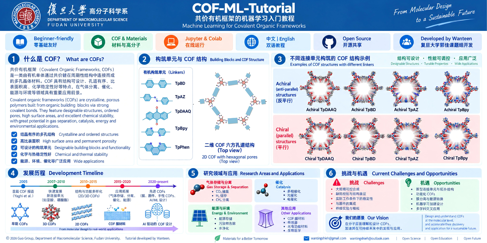

# COF-ML-Tutorial

  
  
  
  
  

<b>从真实 COF 结构和公开数据出发，逐步学习机器学习、性质预测与材料筛选。</b> <b>Machine learning for COFs: from first models to real structures and screening.</b>

<a href="README.md">中文</a> · <a href="README.en.md">English</a> · 

面向 COF / 计算材料方向机器学习初学者。课程按**知识密度与难度**划分主章节，同一知识块中的短教程使用 `A/B/C` 编号，而不是每个短教程占一个完整章节号。

## 掌握度分级

- 🟢 **Level A · 必须掌握**：完成 COF 机器学习基础训练所需。
- 🔵 **Level B · 建议掌握**：面向真实 COF 科研工作流与进阶表示。
- 🟣 **Level C · 了解即可**：用于拓展视野的专项主题。

## 学习路线

`01 快速入门 → 02 COF 数据与特征 → 03 经典机器学习 → 04 真实 COF 科研工作流 → 05 GNN → 06 MLFF`

| Course ID | Level | Topic | 核心目标 | Notebook |
|---|---|---|---|---|
| 01A | 🟢 | Python & data basics | DataFrame、feature、target、X/y | [中文](notebooks/01_python_ml_basics.ipynb) |
| 01B | 🟢 | First ML | 第一次回归 + 分类，建立阶段性成就感 | [中文](notebooks/02_first_ml_regression_classification.ipynb) |
| 02A | 🟢 | COF structure & CIF | 晶胞、PBC、pymatgen、结构 QC | [中文](notebooks/03_cof_structure_cif.ipynb) |
| 02B | 🟢 | COF descriptors | composition / crystal / pore descriptors | [中文](notebooks/04_cof_descriptors.ipynb) |
| 02C | 🟢 | Data preparation | 清洗、特征构造、选择与 scaling | [中文](notebooks/05_data_preparation_feature_engineering.ipynb) |
| 03A | 🟢 | Model comparison | 多种回归与分类模型比较 | [中文](notebooks/06_model_comparison.ipynb) |
| 03B | 🟢 | Validation & tuning | CV、overfitting、leakage、调参 | [中文](notebooks/07_validation_tuning.ipynb) |
| 03C | 🟢 | Interpretation | correlation、permutation、SHAP | [中文](notebooks/08_feature_importance_interpretation.ipynb) |
| 04A | 🟢 | Real COF case study | 真实 CO₂ adsorption 综合项目 | [中文](notebooks/09_real_cof_ml_case_study.ipynb) |
| 04B | 🔵 | CIF → ML | 真实 CIF 自动构建 ML table | [中文](notebooks/10_real_cif_to_ml.ipynb) |
| 04C | 🔵 | High-throughput screening | candidate ranking、适用域、验证 | [中文](notebooks/11_high_throughput_screening.ipynb) |
| 05 | 🔵 | GNN | atomic graph 与 learned representation | [中文](notebooks/12_gnn_for_cofs.ipynb) |
| 06 | 🟣 | MLFF | 机器学习势与原子模拟 | [中文](notebooks/13_mlff.ipynb) |

## 阶段性完成感

- **完成 01：** 已经理解最基本数据结构，并独立跑过一次回归和一次分类。
- **完成 02：** 知道 COF 结构如何变成 ML-ready 数据。
- **完成 03：** 会比较多种模型，也知道怎样验证高分是否可信，并进行解释。
- **完成 04：** 可以完成真实 COF ML 案例，并进一步连接 CIF 与材料筛选。

## COF 背景

COF 是由有机构筑单元通过共价键形成的晶态多孔网络。连接化学、拓扑、孔结构和层间堆积会共同影响吸附、传输和电子性质。

## 公开 COF 数据

- [COFSpace](https://github.com/gokhanonderaksu/COFSpace)：02C–04A 使用 CoRE-COF CO₂ adsorption 数据，并用于筛选示例。
- [CURATED-COFs](https://github.com/danieleongari/CURATED-COFs) / [Wanteen mirror](https://github.com/Wanteen/CURATED-COFs)：04B 用于真实 CIF 解析。
- [CoRE-COF Database](https://github.com/core-cof/CoRE-COF-Database)：实验 COF 结构集合。
- [SupportingInformation_CO2captureHTS_2024](https://github.com/jsdvos/SupportingInformation_CO2captureHTS_2024)：高通量 screening、固定 train/test 与 SHAP 工作流。

`data/cof_demo.csv` 只用于 01A–01B 的低门槛教学体验，其中 `CO2_uptake_demo` 为人工 target，不能用于科研结论。

## 真实 COF 数据集

| 数据源 | 内容 | 教学用途 |
|---|---|---|
| [CURATED-COFs](https://github.com/danieleongari/CURATED-COFs) + [Materials Cloud](https://archive.materialscloud.org/record/2021.100) | 实验报道 COF、优化结构、孔性质、CO₂/N₂ adsorption 数据 | CIF ↔ ID ↔ property、small-data ML、carbon capture |
| [COFSpace](https://github.com/gokhanonderaksu/COFSpace) | 1060 CoRE COFs 的 CO₂/CH₄/H₂/N₂/O₂ 模拟 adsorption、结构/化学/能量 features；另含 hypothetical COF predictions | 多气体/多压力 regression、feature importance、external prediction |
| [ReDD-COFFEE](https://github.com/jsdvos/SupportingInformation_ReDD-COFFEE_2023) | 大规模 hypothetical COF、pore geometry 与 RAC descriptors | representation、diversity、large chemical space |
| [CO₂ capture HTS](https://github.com/jsdvos/SupportingInformation_CO2captureHTS_2024) | ReDD-COFFEE 的 features、GCMC results、固定 train/test split、ML 与 SHAP | high-throughput screening、feature reduction、interpretability |
| [Hypothetical COFs for methane storage](https://www.materialscloud.org/discover/cofs) | 69,840 个 hypothetical 2D/3D COF 与 GCMC methane deliverable capacity | 大规模 screening、structure–property relationship |

04A 补回第二套吸附数据实验，04B 恢复 CIF 到表格的完整实践，04C 连接筛选机制与公开 results/predictions。不同来源先分别建立数据卡，再讨论能否合并。

可直接读取的补充表：[nachatz/cof-data](https://github.com/nachatz/cof-data) · [properties.csv](https://raw.githubusercontent.com/nachatz/cof-data/main/properties.csv) · [simple_features.csv](https://raw.githubusercontent.com/nachatz/cof-data/main/simple_features.csv)

## 按章节扩展阅读

| 章节 | 资源 | 阅读目的 |
|---|---|---|
| 01–04 | [Machine Learning for Materials](https://aronwalsh.github.io/MLforMaterials/) | 材料 ML 全局路线 |
| 02A / 04B | [pymatgen](https://pymatgen.org/) | 晶胞、CIF 与 PBC |
| 02B | [matminer](https://hackingmaterials.lbl.gov/matminer/) | 组成与结构描述符 |
| 05 | [JARVIS notebooks](https://github.com/atomgptlab/jarvis-tools-notebooks) | 材料图与 notebook 示例 |
| 05–06 | [MatGL tutorials](https://matgl.ai/tutorials.html) | 图模型与材料势 |
| 06 | [CHGNet](https://github.com/CederGroupHub/chgnet) | 预训练势与验证 |
| 05 | [ALIGNN](https://github.com/usnistgov/alignn) | 原子与键角图 |
| 03B | [Matbench](https://github.com/materialsproject/matbench) | 可比较的 benchmark |

[数据入口与使用约定](docs/data_resources.md)。科研使用请引用原论文和数据记录，并保存版本、单位、条件及划分。

## 作者与联系

**教程开发:** [Wanteen](https://github.com/Wanteen)  
**所属:** 复旦大学高分子科学系 · 郭佳课题组  
wantingshieh@gmail.com · wantingshieh@outlook.com

## License

[MIT License](LICENSE)
