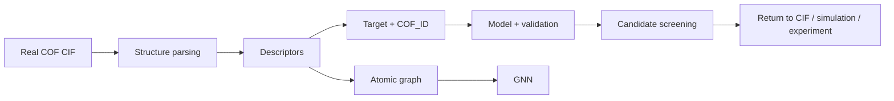

# COF-ML-Tutorial

<p align="center">
  
  
  
  
  
</p>

<p align="center"><b>从真实 COF 结构出发，学习结构表示、性质预测与材料筛选。</b><br><b>Learn structure representation, property prediction, and materials screening from real COF structures.</b></p>

<p align="center"><b>复旦大学高分子科学系 · 郭佳课题组</b><br>Guo Group, Department of Macromolecular Science, Fudan University<br><sub>教程开发：Wanteen · Tutorial developed by Wanteen</sub></p>

<p align="center"><a href="README.md">🇨🇳 中文</a> · <a href="README.en.md">🇬🇧 English</a> · <a href="https://colab.research.google.com/github/Wanteen/COF-ML-Tutorial/blob/main/notebooks/00_start_here_colab.ipynb">▶ Open in Colab</a></p>

---

> 面向 **COF / 计算材料方向新入学研究生** 的机器学习入门教程。  
> **GitHub 阅读 + Google Colab 运行 + 真实 COF CIF + 材料数据实践。**

## 为什么重新设计主线？

本教程早期版本已经覆盖 Python/ML 基础、pymatgen、描述符、真实 COF 数据审计、Random Forest、GNN 与 MLFF，但这些知识点之间存在一个关键断点：学生没有真正完成过一次

```text
真实 COF CIF
→ 结构解析
→ descriptor 构建
→ target 对齐
→ train / test
→ model
→ validation
→ candidate screening
→ 回到结构验证
```

因此目前 Level A 已增加两个核心 capstone：

- **05B Real CIF → ML**：从 CURATED-COFs 的真实 CIF 出发，批量解析结构、构建 descriptor table、用 `COF_ID` 对齐 feature/target，并完成 baseline。
- **05C High-throughput screening**：把已训练模型扩展到 candidate library，理解 surrogate model、材料排序、applicability domain、解释和二次验证。

完整审计与修改依据见 [教学审计 / Teaching Audit](docs/tutorial_audit_2026-09.md)。

## 快速开始

1. 阅读 [00 课程说明](notebooks/00_course_map.ipynb) 与下方 COF 背景。
2. 打开 [中文 Colab 入口](https://colab.research.google.com/github/Wanteen/COF-ML-Tutorial/blob/main/notebooks/00_start_here_colab.ipynb)。
3. 按 `01 → 02 → 03 → 04 → 05 → 05B → 05C` 完成 Level A。
4. 之后再进入 06 GNN 和 07 MLFF。
5. 通过 [双语课程索引](notebooks/README.md) 切换语言与 Colab。

不同 Colab Notebook 使用各自的运行环境；需要仓库或外部数据时，请按对应章节说明初始化。

## COF 背景介绍

**共价有机框架（Covalent Organic Frameworks, COFs）** 是有机构筑单元通过共价键连接形成的晶态多孔网络。构筑单元几何、连接化学、拓扑与层间堆积共同影响孔结构、化学环境和材料性质。

[](assets/cof_background.jpg)

*背景图由 Wanteen 提供，保留图中作者与课题组标注；点击查看高清原图。[图片说明](docs/visual_resources.md)。*

2005 年报道的 COF-1、COF-5 是早期代表，其多孔层状结构展示了从分子设计构筑周期框架的思路。[原始论文](https://doi.org/10.1126/science.1120411)

本课程围绕 **structure → representation → target → model → validation → screening → verification** 展开。具体材料稳定性取决于连接键和使用条件；六方孔或某一种堆积方式也不是所有 COF 的共同特征。

## 课程定位与前置要求

本教程适合刚进入 COF / 计算材料研究、没有系统学习过机器学习的本科高年级学生或研究生。

**Python：** 能看懂变量、list/dict、函数调用、`for` 循环、`import`、DataFrame 等基本代码结构即可。  
**COF / 材料：** 建议理解原子、化学键、晶胞、周期性结构、孔道、密度与吸附等基本概念。  
**机器学习：** 无前置要求。

## 学习层级

| 层级 | 内容 | 完成标准 |
|---|---|---|
| 🟢 Level A | 01–05C | **必须掌握**：完成真实 CIF 到 baseline 与 screening 的完整闭环 |
| 🔵 Level B | 06 GNN | **建议了解**：理解 atomic graph、message passing 与 learned representation |
| 🟣 Supplement | 07 MLFF | **补充阅读**：理解 MLFF 与 DFT / MD 的关系 |

## 课程目录

| Chapter | Level | Topic | 主要问题 | 中文 | English | Colab |
|---|---|---|---|---|---|---|
| 00 | 🧭 | Course map | 课程怎么学？ | [中文](notebooks/00_course_map.ipynb) | [English](notebooks/en/00_course_map.ipynb) | [▶](https://colab.research.google.com/github/Wanteen/COF-ML-Tutorial/blob/main/notebooks/00_course_map.ipynb) |
| 01 | 🟢 A | ML basics | feature、target、train/test 是什么？ | [中文](notebooks/01_python_ml_basics.ipynb) | [English](notebooks/en/01_python_ml_basics.ipynb) | [▶](https://colab.research.google.com/github/Wanteen/COF-ML-Tutorial/blob/main/notebooks/01_python_ml_basics.ipynb) |
| 02 | 🟢 A | Structure + pymatgen | CIF、晶胞、坐标、PBC 是什么？ | [中文](notebooks/02_pymatgen_structure.ipynb) | [English](notebooks/en/02_pymatgen_structure.ipynb) | [▶](https://colab.research.google.com/github/Wanteen/COF-ML-Tutorial/blob/main/notebooks/02_pymatgen_structure.ipynb) |
| 03 | 🟢 A | Descriptors | 如何把材料变成模型能读取的数字？ | [中文](notebooks/03_material_descriptors.ipynb) | [English](notebooks/en/03_material_descriptors.ipynb) | [▶](https://colab.research.google.com/github/Wanteen/COF-ML-Tutorial/blob/main/notebooks/03_material_descriptors.ipynb) |
| 04 | 🟢 A | Real COF data | 真实数据库为什么不能直接训练？ | [中文](notebooks/04_real_cof_dataset.ipynb) | [English](notebooks/en/04_real_cof_dataset.ipynb) | [▶](https://colab.research.google.com/github/Wanteen/COF-ML-Tutorial/blob/main/notebooks/04_real_cof_dataset.ipynb) |
| 05 | 🟢 A | Baseline prediction | 如何训练、评价并避免虚假高精度？ | [中文](notebooks/05_cof_property_prediction.ipynb) | [English](notebooks/en/05_cof_property_prediction.ipynb) | [▶](https://colab.research.google.com/github/Wanteen/COF-ML-Tutorial/blob/main/notebooks/05_cof_property_prediction.ipynb) |
| **05B** | 🟢 A | **Real CIF → ML** | **如何从真实 CIF 自动构建 feature/target mapping？** | [中文](notebooks/05B_real_cof_cif_to_ml.ipynb) | [English](notebooks/en/05B_real_cof_cif_to_ml.ipynb) | [▶](https://colab.research.google.com/github/Wanteen/COF-ML-Tutorial/blob/main/notebooks/05B_real_cof_cif_to_ml.ipynb) |
| **05C** | 🟢 A | **High-throughput screening** | **训练模型后如何筛选未知 COF？** | [中文](notebooks/05C_high_throughput_screening.ipynb) | [English](notebooks/en/05C_high_throughput_screening.ipynb) | [▶](https://colab.research.google.com/github/Wanteen/COF-ML-Tutorial/blob/main/notebooks/05C_high_throughput_screening.ipynb) |
| 06 | 🔵 B | GNN | 为什么可以直接从原子图学习？ | [中文](notebooks/06_gnn_for_materials.ipynb) | [English](notebooks/en/06_gnn_for_materials.ipynb) | [▶](https://colab.research.google.com/github/Wanteen/COF-ML-Tutorial/blob/main/notebooks/06_gnn_for_materials.ipynb) |
| 07 | 🟣 Supplement | MLFF | MLFF 与 DFT / MD 有什么关系？ | [中文](notebooks/07_mlff_chgnet.ipynb) | [English](notebooks/en/07_mlff_chgnet.ipynb) | [▶](https://colab.research.google.com/github/Wanteen/COF-ML-Tutorial/blob/main/notebooks/07_mlff_chgnet.ipynb) |

## 一张图理解整门课



## 推荐学习顺序

- Week 1：00–01，理解 feature、target、model、training/test。
- Week 2：02，理解晶胞、周期性、CIF 与 pymatgen。
- Week 3：03，理解 representation 与 descriptors。
- Week 4：04，练习真实 COF 数据审计和 provenance。
- Week 5：05，掌握 baseline、split、leakage 与 validation。
- Week 6：05B，从真实 CIF 自动建立 ML 表格。
- Week 7：05C，完成 surrogate screening 与候选验证逻辑。
- Week 8（可选）：06 GNN。
- Supplementary：07 MLFF。

## 数据说明

- [Wanteen/CURATED-COFs](https://github.com/Wanteen/CURATED-COFs)：05B 使用的真实 COF CIF 与 metadata 来源。
- `data/cof_demo.csv`：教学数据；其中 `CO2_uptake_demo` 为人工构造 target，**不能用于科研结论**。
- 05C 的 candidate target 同样为教学公式生成，仅用于理解 HTS + surrogate workflow。

真实 CO₂ adsorption/selectivity 项目应使用统一温度、压力、计算协议或实验条件下的 target，并记录完整 provenance。

## 值得借鉴的 COF / porous-material ML 仓库

- [SupportingInformation_CO2captureHTS_2024](https://github.com/jsdvos/SupportingInformation_CO2captureHTS_2024)：COF CO₂ high-throughput screening、ML、train/test lists、SHAP。
- [CURATED-COFs](https://github.com/Wanteen/CURATED-COFs)：实验 COF CIF、结构清理和 provenance。
- [CoRE-COF Database](https://github.com/core-cof/CoRE-COF-Database)：更大规模 COF 数据库与版本化结构集合。
- [mofdscribe](https://github.com/kjappelbaum/mofdscribe)：多孔材料 featurization、benchmark 和 splitting 思路。

通用工具：

- [pymatgen](https://pymatgen.org/)
- [matminer](https://hackingmaterials.lbl.gov/matminer/)
- [MatGL](https://matgl.ai/)
- [CHGNet](https://github.com/CederGroupHub/chgnet)
- [ALIGNN](https://github.com/atomgptlab/alignn)
- [Matbench](https://github.com/materialsproject/matbench)

## 本地运行环境

```bash
git clone https://github.com/Wanteen/COF-ML-Tutorial.git
cd COF-ML-Tutorial
python -m venv .venv
# Windows PowerShell: .venv\Scripts\Activate.ps1
# macOS / Linux: source .venv/bin/activate
python -m pip install -r requirements.txt
python -m pip install jupyterlab
python -m jupyterlab
```

## COF 延伸阅读

1. Côté, A. P. et al. *Porous, Crystalline, Covalent Organic Frameworks*. Science (2005). [DOI: 10.1126/science.1120411](https://doi.org/10.1126/science.1120411).
2. El-Kaderi, H. M. et al. *Designed Synthesis of 3D Covalent Organic Frameworks*. Science (2007). [DOI: 10.1126/science.1139915](https://doi.org/10.1126/science.1139915).
3. Kandambeth, S. et al. *Construction of Crystalline 2D Covalent Organic Frameworks with Remarkable Chemical (Acid/Base) Stability via a Combined Reversible and Irreversible Route*. JACS (2012). [DOI: 10.1021/ja308278w](https://doi.org/10.1021/ja308278w).

## 作者与联系

**教程开发:** [Wanteen](https://github.com/Wanteen)  
**所属:** 复旦大学高分子科学系 · 郭佳课题组  
Guo Group, Department of Macromolecular Science, Fudan University

- [wantingshieh@gmail.com](mailto:wantingshieh@gmail.com)
- [wantingshieh@outlook.com](mailto:wantingshieh@outlook.com)

课程勘误与可复现的问题可通过 [Issues](https://github.com/Wanteen/COF-ML-Tutorial/issues) 反馈，请附章节、运行环境与报错信息。

## 许可证

[MIT License](LICENSE)
